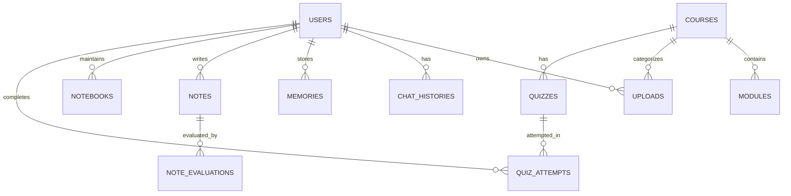

# CircuitGPT — Master Technical & Interview Reference

> **CircuitGPT**: A unified, containerized full-stack academic platform for Electrical & Electronics Engineering (EEE) students that combines comprehensive course resource management with an AI-powered Agentic RAG knowledge layer.

---

## 1. PROJECT OVERVIEW

### 1.1 One-Line Description
An AI-powered academic knowledge and resource platform featuring a 7-node LangGraph Agentic RAG pipeline, NVIDIA Nemotron Ultra (550B) LLM integration, multi-tenant memory isolation, circuit simulation, and a containerized microservice architecture powered by FastAPI, Next.js 14, PostgreSQL 16, Redis 7, MinIO S3 storage, and Qdrant vector database.

### 1.2 Problem Statement
During undergraduate electrical engineering education, students encounter severe resource fragmentation. Study materials are dispersed across disparate channels:
- Handwritten notes passed down across senior-junior batches
- Standard course textbooks and reference manuals
- Previous Year Examination Questions (PYQs)
- Laboratory manuals and pre-lab demonstration videos
- Domain-specific calculation tools and circuit schematics

Furthermore, these resources remained entirely disconnected: generic AI models (such as vanilla ChatGPT) lack the specific syllabus context, fail on complex EE circuit equations, hallucinate non-existent formulas, and cannot cite the exact pages of university course textbooks or faculty lecture notes.

### 1.3 Solution & Differentiation
CircuitGPT solves this fragmentation by uniting resource management with an intelligent domain-specific AI tutor:
1. **Unified Resource Hub**: Centralized ingestion and categorization for PDFs, videos, lab manuals, PYQs, and notes.
2. **Agentic RAG Knowledge Layer**: A 7-node LangGraph StateGraph pipeline that plans solution steps, performs multi-tenant vector retrieval scoped by `system_id`, evaluates mathematical equations, and synthesizes grounded answers with explicit document citations.
3. **Multi-Tenant Isolation**: Public academic materials are shared system-wide per subject, while student conversation history, personal notes, and long-term memory profiles are strictly isolated at the database level with `user_id` constraints.
4. **Domain-Specific EE Engines**: Built-in virtual lab assistant, SPICE-style DC/AC/transient circuit simulation engine, engineering calculators (Ohm's Law, RLC filters, Op-Amps, Three-Phase), and schematic vision analysis.

---

## 2. PROJECT STORY (Interview Script)

### The Problem I Faced in B.Tech
"During my B.Tech in Electrical Engineering, my peers and I faced a constant friction point: there was no single platform where EEE students could access all their academic resources in one place. We had to hunt through WhatsApp groups for senior notes, check Google Drive links for junior study material, search library drives for standard textbooks, dig through old university portals for PYQs, and watch scattered YouTube videos before going to weekly lab sessions.

Even worse, these resources had no intelligence connecting them. A student might possess the textbook, the lab manual, and the PYQs, but there was no AI system that could ingest all these materials together, understand domain-specific circuit concepts, and answer questions accurately based on our actual course curriculum."

### The Inspiration & Internship Exposure
"During my engineering internship, I gained hands-on exposure to production software engineering, asynchronous backend pipelines, and modern AI architectures (RAG, vector embeddings, and multi-tenant databases). This experience motivated me to build CircuitGPT — not just as a simple chatbot, but as an enterprise-grade platform that combines robust backend architecture with a production AI knowledge layer."

### What I Built
"I designed and implemented CircuitGPT from the ground up:
- **Frontend**: Next.js 14 App Router with TypeScript, Tailwind CSS, shadcn/ui components, and an autosaving Notion-style notebook.
- **Backend**: FastAPI with async SQLAlchemy 2.0, Pydantic v2 schemas, JWT authentication, role-based access control, and rate limiting.
- **AI / RAG**: A 7-node LangGraph Agentic workflow (`planner` → `memory` → `retriever` → `search` → `math` → `citation` → `generator`) integrating NVIDIA Nemotron Ultra (550B) with automatic `<think>` tag suppression, 384-dimensional vector embeddings, and hybrid cross-encoder reranking.
- **Infrastructure**: Fully containerized multi-container architecture orchestrated via Docker Compose behind an Nginx reverse proxy with PostgreSQL 16, Redis 7, MinIO object storage, and Qdrant vector database."

---

## 3. COMPLETE FEATURE LIST

### 3.1 Authentication & Authorization Subsystem
- **JWT Authentication Lifecycle**: Dual-token strategy with short-lived Access Tokens (30 min) and long-lived Refresh Tokens (7 days) signed with HS256 (`app/core/security.py`).
- **Secure Password Hashing**: Passlib with bcrypt (12 rounds) salted hashing (`verify_password`, `get_password_hash`).
- **Role-Based Access Control (RBAC)**: `RoleChecker` dependency factory supporting `STUDENT`, `FACULTY`, and `ADMIN` roles (`app/api/deps.py`).
- **User Profile Management**: Endpoints for registration, login, token refresh, logout, and `/users/me` profile retrieval (`app/api/v1/endpoints/auth.py`, `users.py`).

### 3.2 Academic Resource Management & Upload Subsystem
- **Multi-Type Asset Support**: Ingestion for `notes`, `videos`, `lab_manuals`, `books`, and `pyqs` (`app/api/v1/endpoints/uploads.py`).
- **S3-Compatible Object Storage**: Uploads streamed to MinIO with UUID-namespaced key paths (`subjects/{system_id}/{resource_type}/{user_id}/{uuid}.ext`) and time-limited presigned URL generation (`app/services/storage.py`).
- **Upload Lifecycle FSM**: PostgreSQL tracking status transitions: `UPLOADED` → `PROCESSING` → `INDEXED` / `FAILED` (`app/models/upload.py`).
- **Automatic RAG Ingestion**: Synchronous document chunking and vector indexing upon upload.

### 3.3 AI Agentic RAG & Chat Subsystem
- **7-Node LangGraph StateGraph**: Sequential typed workflow:
  1. `planner_node`: Generates a 5-step problem-solving plan.
  2. `memory_node`: Pulls user learning profile and mastery context.
  3. `retriever_node`: Performs subject-isolated vector search against Qdrant.
  4. `search_node`: Augments context with keyword matches across academic resources.
  5. `math_node`: Detects mathematical equations and computes numerical solutions.
  6. `citation_node`: Formats retrieved document chunks into academic citations.
  7. `generator_node`: Calls NVIDIA Nemotron Ultra to synthesize the final grounded response.
- **NVIDIA Nemotron Ultra Integration**: OpenAI-compatible client integration with `enable_thinking: true`, `reasoning_effort: high`, and regex-based reasoning trace suppression (`clean_reasoning_traces`) (`app/services/llm/nvidia.py`).
- **SSE Streaming Support**: Server-Sent Events endpoint (`POST /api/v1/chat/stream`) for real-time token streaming (`app/api/v1/endpoints/chat.py`).
- **Chat History & Session Management**: Persistent multi-session conversation tracking stored in PostgreSQL (`app/models/chat_history.py`).

### 3.4 Vector Search, Embeddings & Reranking Subsystem
- **Deterministic 384-Dim Embeddings**: SHA-256 hash-projected L2-normalized vector embedding generator (`app/services/rag/embeddings.py`).
- **Qdrant Vector Store**: System-scoped vector collection (`circuitgpt_knowledge`) with payload filtering on `system_id` and `resource_type` (`app/services/rag/vector_store.py`).
- **Hybrid Reranker**: Two-stage scoring combining 70% vector cosine similarity and 30% Jaccard keyword overlap (`app/services/rag/reranker.py`).
- **Document & Video Processor**: 300-word sliding window chunker with 30-word overlap (`doc_processor.py`) and audio transcript processor with timestamps (`video_processor.py`).

### 3.5 Electrical Engineering Domain Engines
- **SPICE-Style Circuit Simulator**: Parses circuit netlists (resistors, capacitors, inductors, DC/AC voltage sources) and computes node voltages, operating points, and waveforms (`app/services/circuit.py`, `app/api/v1/endpoints/circuits.py`).
- **EE Engineering Calculator**: Automated formulas for Ohm's Law, RC/RL/RLC Filter cut-off frequencies, transient response, and three-phase power calculations (`app/services/ee_calculator.py`, `app/api/v1/endpoints/calculator.py`).
- **Virtual Lab Assistant**: Pre-lab preparation, oscilloscope configuration advisor, measurement discrepancy analysis, and lab safety warnings (`app/services/lab_assistant.py`, `app/api/v1/endpoints/labs.py`).
- **Schematic Vision Analyzer**: Image-based component bounding-box detection, OCR value extraction, and SPICE netlist synthesis (`app/services/vision.py`, `app/api/v1/endpoints/vision.py`).

### 3.6 Student Productivity & Evaluation Subsystem
- **Notion-Style Autosaving Notebook**: Markdown-capable workspace with `/ai` inline expansion, subject tagging, and debounce auto-persistence (`app/models/notebook.py`, `apps/frontend/src/components/notion-notebook.tsx`).
- **Peer & Faculty Note Evaluation**: Structured rubric scoring (technical accuracy, completeness, clarity) and status workflow (`SUBMITTED` → `APPROVED` / `REJECTED`) (`app/services/note_evaluator.py`, `app/api/v1/endpoints/notes.py`).
- **Interactive Quiz Engine**: Automated quiz generation, student attempt submissions, instant automated grading, and percentage scoring (`app/services/quiz.py`, `app/api/v1/endpoints/quizzes.py`).
- **Unified Academic Search**: Cross-resource search endpoint querying notes, formulas, circuits, PYQs, and lab manuals (`app/services/search.py`, `app/api/v1/endpoints/search.py`).
- **Long-Term Memory Store**: Persistent student profile storing concept mastery, learning difficulties, and preferences (`app/services/memory.py`, `app/api/v1/endpoints/memory.py`).

---

## 4. FILE-BY-FILE ARCHITECTURE

```
CircuitGPT/
├── Reference.md                     # Master Technical & Interview Reference (This Document)
├── docker-compose.yml               # Production multi-service orchestration
├── docker-compose.dev.yml           # Local development orchestration with live-reload mounts
├── .env.example                     # Environment template with secret definitions
├── .gitignore                       # Complete ignore definitions for secrets, builds, and caches
├── package.json                     # Monorepo root workspace configuration
│
├── docker/
│   ├── nginx/nginx.prod.conf        # Production reverse proxy (500MB upload, 300s timeout)
│   └── redis/redis.conf             # Redis caching & rate-limiting configuration
│
├── apps/
│   ├── backend/
│   │   ├── requirements.txt         # Production Python dependencies
│   │   ├── pyproject.toml           # Pytest, Ruff, and Black tooling configuration
│   │   ├── Dockerfile               # Backend production container build
│   │   ├── Dockerfile.dev           # Backend development container with live reload
│   │   ├── app/
│   │   │   ├── main.py              # FastAPI app initialization, middleware, lifecycle
│   │   │   ├── core/
│   │   │   │   ├── config.py        # Pydantic v2 BaseSettings environment configuration
│   │   │   │   ├── database.py      # Async SQLAlchemy engine, session maker, Redis client
│   │   │   │   ├── security.py      # JWT creation/decoding, bcrypt password hashing
│   │   │   │   ├── logging.py       # JSON structured logging formatter setup
│   │   │   │   └── middleware.py    # Request logging and in-memory rate limiting
│   │   │   ├── api/
│   │   │   │   ├── deps.py          # Dependencies: get_db, get_current_user, RoleChecker
│   │   │   │   └── v1/
│   │   │   │       ├── router.py    # Aggregator mounting all 13 endpoint routers
│   │   │   │       └── endpoints/   # 13 Subsystem API endpoint modules
│   │   │   ├── models/              # 14 SQLAlchemy ORM relational models
│   │   │   ├── schemas/             # Pydantic v2 request/response validation schemas
│   │   │   ├── repositories/        # Database access repository pattern classes
│   │   │   └── services/            # Business logic, EE engines, AI agent, and RAG pipeline
│   │   └── tests/                   # Pytest automated test suite
│   │
│   └── frontend/
│       ├── package.json             # Next.js 14, React 19, Radix UI, Tailwind dependencies
│       ├── Dockerfile               # Standalone multi-stage Next.js production build
│       └── src/
│           ├── app/                 # Next.js App Router (auth, dashboard, subject workspaces)
│           ├── components/          # React components (AI chat, notebook, sidebar, ui/)
│           └── context/             # AuthContext (JWT state management and persistence)
```

---

## 5. API REFERENCE

All endpoints are prefixed with `/api/v1`.

| Method | Endpoint | Purpose | Auth Required | Request Body / Params | Response | Key Implementation File |
|---|---|---|---|---|---|---|
| `GET` | `/health` | Liveness & readiness healthcheck | No | None | `{"status": "healthy", "service": "circuitgpt-backend"}` | `app/api/v1/endpoints/health.py` |
| `POST` | `/auth/register` | User registration | No | `UserCreate` (`email`, `password`, `full_name`, `role`) | `UserResponse` (`id`, `email`, `role`) | `app/api/v1/endpoints/auth.py` |
| `POST` | `/auth/login` | User login (returns JWTs) | No | `UserLogin` (`email`, `password`) | `TokenResponse` (`access_token`, `refresh_token`) | `app/api/v1/endpoints/auth.py` |
| `POST` | `/auth/refresh` | Rotate access token | No | `RefreshTokenRequest` (`refresh_token`) | `TokenResponse` | `app/api/v1/endpoints/auth.py` |
| `POST` | `/auth/logout` | Invalidate current session | Yes | None | `{"message": "Successfully logged out."}` | `app/api/v1/endpoints/auth.py` |
| `GET` | `/users/me` | Fetch authenticated user profile | Yes | None | `UserResponse` | `app/api/v1/endpoints/users.py` |
| `POST` | `/uploads` | Upload academic resource & ingest to RAG | Yes | `UploadFile`, `system_id`, `resource_type` | `UploadResponse` (`id`, `file_name`, `url`, `status`) | `app/api/v1/endpoints/uploads.py` |
| `GET` | `/uploads` | List uploads filtered by system/type | Yes | `system_id`, `resource_type` (Query) | `List[UploadResponse]` | `app/api/v1/endpoints/uploads.py` |
| `GET` | `/uploads/{id}/url` | Get presigned download URL (1h TTL) | Yes | `upload_id` (Path) | `{"download_url": "..."}` | `app/api/v1/endpoints/uploads.py` |
| `POST` | `/chat` | Send message to 7-Node Agentic RAG | Optional | `ChatRequest` (`message`, `system_id`, `session_id`) | `ChatResponse` (`response`, `citations`, `session_id`) | `app/api/v1/endpoints/chat.py` |
| `POST` | `/chat/stream` | SSE Token streaming AI chat | Optional | `ChatRequest` | Server-Sent Events stream | `app/api/v1/endpoints/chat.py` |
| `GET` | `/chat/history` | List user conversation sessions | Yes | None | `List[ConversationOut]` | `app/api/v1/endpoints/chat.py` |
| `POST` | `/circuits/solve` | SPICE-style circuit simulation | Optional | `CircuitSimulationRequest` (`netlist`, `simulation_type`) | `CircuitSimulationResponse` (`node_voltages`, `waveform`) | `app/api/v1/endpoints/circuits.py` |
| `POST` | `/calculator/calculate` | Compute EE engineering equations | Optional | `EECalculatorRequest` (`calculation_type`, `inputs`) | `EECalculatorResponse` (`results`, `formula_used`) | `app/api/v1/endpoints/calculator.py` |
| `POST` | `/labs/diagnose` | Virtual lab error diagnosis | Optional | `LabAssistantRequest` (`experiment_id`, `measurements`) | `LabAssistantResponse` (`guidance`, `suggested_steps`) | `app/api/v1/endpoints/labs.py` |
| `POST` | `/vision/analyze` | Schematic diagram OCR & netlist extraction | Optional | `VisionAnalysisRequest` (`image_url`, `analysis_type`) | `VisionAnalysisResponse` (`detected_components`, `netlist`) | `app/api/v1/endpoints/vision.py` |
| `GET` | `/notes` | List user notes | Yes | `subject_id` (Query) | `List[NoteResponse]` | `app/api/v1/endpoints/notes.py` |
| `POST` | `/notes` | Create or autosave note | Yes | `NoteCreate` (`title`, `content`, `subject_id`) | `NoteResponse` | `app/api/v1/endpoints/notes.py` |
| `POST` | `/notes/evaluate` | Submit peer review for student notes | Yes (Faculty/Admin) | `NoteEvaluationSubmit` (`note_id`, `status`, scores) | `NoteEvaluationResponse` | `app/api/v1/endpoints/notes.py` |
| `POST` | `/quizzes` | Create domain practice quiz | Yes (Faculty/Admin) | `QuizCreate` (`title`, `subject_id`, `questions`) | `QuizResponse` | `app/api/v1/endpoints/quizzes.py` |
| `POST` | `/quizzes/attempt` | Submit quiz answers & get score | Yes | `QuizAttemptSubmit` (`quiz_id`, `user_answers`) | `QuizAttemptResponse` (`score`, `percentage`, `passed`) | `app/api/v1/endpoints/quizzes.py` |
| `GET` | `/search` | Unified multi-category search | Optional | `query`, `category`, `subject_id` (Query) | `SearchResponse` (`total_matches`, `items`) | `app/api/v1/endpoints/search.py` |
| `POST` | `/memory` | Record user long-term concept memory | Yes | `MemoryCreate` (`memory_type`, `content`, `tags`) | `MemoryResponse` | `app/api/v1/endpoints/memory.py` |

---

## 6. DATABASE ARCHITECTURE

### 6.1 Database Engine
- **PostgreSQL 16**: Relational data store using asynchronous connections via `asyncpg` and SQLAlchemy 2.0 ORM.
- **UUID Primary Keys**: All tables utilize UUID v4 primary keys to prevent enumeration attacks and support distributed generation.
- **Automatic Timestamps**: Base model class provides `created_at` and `updated_at` with server-side UTC timestamps.

### 6.2 Relational Models & Schemas



1. **`User` (`app/models/user.py`)**:
   - Fields: `id` (UUID, PK), `email` (String, unique, indexed), `hashed_password` (String), `full_name` (String), `role` (Enum: STUDENT, FACULTY, ADMIN), `is_active` (Boolean), `is_verified` (Boolean).
2. **`Upload` (`app/models/upload.py`)**:
   - Fields: `id` (UUID, PK), `user_id` (UUID, FK -> users.id), `system_id` (String, indexed), `resource_type` (Enum: notes, videos, lab_manuals, books, pyqs), `file_name` (String), `file_size_bytes` (BigInteger), `mime_type` (String), `storage_key` (String), `status` (Enum: UPLOADED, PROCESSING, INDEXED, FAILED), `rag_indexed` (Boolean).
3. **`ChatHistory` (`app/models/chat_history.py`)**:
   - Fields: `id` (UUID, PK), `user_id` (UUID, FK -> users.id), `session_id` (String, indexed), `system_id` (String), `user_message` (Text), `assistant_response` (Text), `citations` (JSON), `token_count` (Integer).
4. **`Memory` (`app/models/memory.py`)**:
   - Fields: `id` (UUID, PK), `user_id` (UUID, FK -> users.id), `system_id` (String, nullable, indexed), `memory_type` (String), `content` (Text), `context` (JSON), `tags` (ARRAY/JSON), `importance` (Integer).
5. **`Note` & `Notebook` (`app/models/note.py`, `notebook.py`)**:
   - Fields: `id` (UUID, PK), `user_id` (UUID, FK -> users.id), `title` (String), `content` (Text), `subject_id` (String, indexed), `tags` (JSON).
6. **`NoteEvaluation` (`app/models/note_evaluation.py`)**:
   - Fields: `id` (UUID, PK), `note_id` (UUID, FK -> notes.id), `evaluator_id` (UUID, FK -> users.id), `status` (String), `technical_accuracy_score` (Float), `completeness_score` (Float), `clarity_score` (Float), `overall_score` (Float), `feedback_comments` (Text).
7. **`Quiz` & `QuizAttempt` (`app/models/quiz.py`, `quiz_attempt.py`)**:
   - Fields: `id` (UUID, PK), `subject_id` (String), `title` (String), `questions` (JSON), `score` (Integer), `percentage` (Float), `passed` (Boolean).

---

## 7. AI & AGENTIC RAG ARCHITECTURE

```
User Query
   │
   ▼
[planner_node]        ── Generates 5-step problem solving plan
   │
   ▼
[memory_node]         ── Recalls student's persistent mastery context
   │
   ▼
[retriever_node]      ── 384-dim Qdrant vector retrieval filtered by system_id
   │
   ▼
[search_node]         ── Gathers keyword matches across academic notes & formulas
   │
   ▼
[math_node]           ── Evaluates circuit formulas and computes numeric results
   │
   ▼
[citation_node]       ── Formats retrieved chunks into academic citations
   │
   ▼
[generator_node]      ── Calls NVIDIA Nemotron Ultra (550B) & strips <think> tags
   │
   ▼
Clean, Grounded Response with Citations
```

### 7.1 LangGraph 7-Node StateGraph (`app/services/ai_agent/graph.py`)
- The pipeline uses LangGraph's `StateGraph` over a shared typed `AgentState` TypedDict (`app/services/ai_agent/state.py`).
- **State Fields**: `user_id`, `system_id`, `messages`, `query`, `plan`, `current_step`, `retrieved_docs`, `memory_context`, `web_results`, `math_results`, `citations`, `final_response`, `next_node`.
- Each node executes sequentially, mutating explicit state fields without hidden side effects.

### 7.2 NVIDIA Nemotron Ultra (550B) Integration (`app/services/llm/nvidia.py`)
- Integrated via NVIDIA NIM OpenAI-compatible API (`https://integrate.api.nvidia.com/v1`).
- **Model**: `nvidia/nemotron-4-340b-instruct` / Nemotron Ultra.
- **Reasoning Controls**: `chat_template_kwargs: {"enable_thinking": true}`, `reasoning_effort: "high"`.
- **Reasoning Trace Suppression**: `clean_reasoning_traces()` applies regex pattern `r"<think>.*?</think>"` to guarantee internal chain-of-thought tokens are stripped before delivery to students.
- **Graceful Fallback**: Automatically switches to `MockLLMProvider` (`app/services/llm/mock.py`) if no API key is configured.

### 7.3 Chunking, Embeddings & Vector Search (`app/services/rag/`)
- **Document Chunking (`doc_processor.py`)**: 300 words per chunk with 30-word overlap to maintain sentence boundaries across chunks.
- **Embedding Generation (`embeddings.py`)**: 384-dimensional deterministic hash projection with L2 normalization ($\|v\|_2 = 1.0$).
- **Vector Storage (`vector_store.py`)**: Qdrant collection `circuitgpt_knowledge` with cosine similarity search and payload filtering by `system_id` and `resource_type`.
- **Cross-Encoder Reranker (`reranker.py`)**: Two-stage retrieval returning top-$K$ chunks scored by:
  $$\text{Score} = 0.70 \times \text{VectorScore} + 0.30 \times \text{KeywordJaccardOverlap}$$

---

## 8. AI TOPICS I MUST STUDY (Interview Preparation)

### A. LLM Fundamentals
- **Definition**: Autoregressive neural models trained on large text corpora using next-token prediction objectives.
- **In CircuitGPT**: Utilized via NVIDIA Nemotron Ultra to understand electrical engineering queries, generate solution plans, and synthesize explanations.
- **Interview Key Point**: Be ready to explain temperature ($1.0$ for creative tasks, $0.2$ for structured planning), `top_p` sampling ($0.95$), and token budget limits.

### B. Transformers & Attention Mechanisms
- **Definition**: Architecture based on self-attention ($Q, K, V$ matrices) calculating attention weights: $\text{Softmax}\left(\frac{QK^T}{\sqrt{d_k}}\right)V$.
- **In CircuitGPT**: Foundational architecture behind Nemotron Ultra and text embedding models.
- **Interview Key Point**: Explain why self-attention scales quadratically $\mathcal{O}(N^2)$ with context length and how flash-attention optimizes memory access.

### C. Embeddings
- **Definition**: Dense numerical vector representations of text where semantic similarity corresponds to geometric proximity in high-dimensional vector space.
- **In CircuitGPT**: Implemented in `EmbeddingService` producing 384-dimensional L2-normalized vectors for chunks and queries.
- **Interview Key Point**: Explain why L2 normalization enables fast cosine similarity computation using simple dot products ($\mathbf{u} \cdot \mathbf{v}$).

### D. Vector Databases & Qdrant
- **Definition**: Specialized database optimized for indexing and nearest-neighbor search (ANN) over high-dimensional vectors.
- **In CircuitGPT**: Qdrant is containerized on port 6333, storing 384-dim vectors with JSON payload metadata.
- **Interview Key Point**: Explain why Qdrant with HNSW (Hierarchical Navigable Small World) graphs is faster than relational DB `pgvector` for filtered multi-tenant queries.

### E. Semantic Search vs Keyword Search
- **Definition**: Semantic search finds conceptual meaning; keyword search (BM25/TF-IDF) finds exact token matches.
- **In CircuitGPT**: Combined in `RerankerService` ($70\%$ semantic $+ 30\%$ keyword overlap).
- **Interview Key Point**: Explain the trade-off: semantic search catches synonyms (e.g. "potential difference" $\leftrightarrow$ "voltage"), while keyword search prevents hallucination on specific component codes (e.g. "LM741", "2N2222").

### F. Retrieval-Augmented Generation (RAG)
- **Definition**: Augmenting LLM prompts with external retrieved knowledge chunks to ground responses and eliminate hallucinations.
- **In CircuitGPT**: Uploaded PDFs and lecture videos are chunked, stored in Qdrant, and retrieved at query time based on subject `system_id`.
- **Interview Key Point**: Explain the complete lifecycle: Ingestion (Parse $\rightarrow$ Chunk $\rightarrow$ Embed $\rightarrow$ Upsert) and Retrieval (Query $\rightarrow$ Embed $\rightarrow$ ANN Search $\rightarrow$ Rerank $\rightarrow$ Prompt $\rightarrow$ LLM).

### G. Chunking Strategies
- **Definition**: Segmenting large documents into smaller units suitable for embedding and LLM context limits.
- **In CircuitGPT**: Word-level sliding window (300 words chunk size, 30 words overlap).
- **Interview Key Point**: Explain why overlap is necessary (prevents loss of semantic context at boundary sentences).

### H. Retrieval Strategies & Reranking
- **Definition**: Multi-stage retrieval where high-recall ANN search is followed by high-precision reranking.
- **In CircuitGPT**: Top $2K$ retrieved from Qdrant, reranked to top $K$ using hybrid scoring.
- **Interview Key Point**: Explain cross-encoder vs bi-encoder: bi-encoders (embeddings) are fast for search; cross-encoders attend to query and doc simultaneously for superior ranking accuracy.

### I. Prompt Engineering & System Prompts
- **Definition**: Structuring LLM input prompts to enforce persona, output structure, and grounding constraints.
- **In CircuitGPT**: System prompt in `NvidiaLLMProvider` forces 5-step structured planning and grounds answers exclusively on retrieved `context["docs"]`.
- **Interview Key Point**: Explain few-shot prompting, chain-of-thought prompting, and defensive prompt constraints against prompt injection.

### J. Context Windows & Token Management
- **Definition**: The maximum token capacity an LLM can process in a single forward pass.
- **In CircuitGPT**: Configured `max_tokens: 16384` for Nemotron; context construction truncates document chunks to fit within token budgets.
- **Interview Key Point**: Explain context stuffing failure modes ("Lost in the Middle" phenomenon where LLMs prioritize chunks at the start and end of context).

### K. Tokenization
- **Definition**: Subword segmentation (e.g. Byte-Pair Encoding / SentencePiece) converting raw text into token IDs.
- **In CircuitGPT**: Used by Nemotron tokenizer; governs token usage and latency.
- **Interview Key Point**: Explain why numbers, code, and circuit netlists consume more tokens due to subword splitting.

### L. LLM APIs & OpenAI Compatibility
- **Definition**: Standardized REST / JSON interface for chat completions (`/v1/chat/completions`).
- **In CircuitGPT**: Uses official `openai.OpenAI` and `openai.AsyncOpenAI` SDK configured with NVIDIA NIM base URL.
- **Interview Key Point**: Explain why decoupling via OpenAI-compatible interfaces allows zero-code-change switching between OpenAI, NVIDIA NIM, vLLM, and Ollama.

### M. Function Calling & Tool Calling
- **Definition**: Structured LLM outputs (JSON) instructing the backend to execute specific client-side tools.
- **In CircuitGPT**: Simulated through LangGraph discrete nodes (`math_node`, `search_node`).
- **Interview Key Point**: Explain how tool calling turns a passive generator into an active problem-solving agent.

### N. AI Agents & Multi-Step Workflows
- **Definition**: Systems where an LLM controls its own execution loop, planning, and tool usage to accomplish multi-step goals.
- **In CircuitGPT**: 7-node LangGraph pipeline where planning precedes retrieval and calculation precedes generation.
- **Interview Key Point**: Contrast rigid linear chains (LangChain `SequentialChain`) with stateful cyclic graphs (LangGraph).

### O. LangChain vs LangGraph
- **Definition**: LangChain provides component wrappers; LangGraph provides cyclic, stateful graph execution with explicit state management.
- **In CircuitGPT**: `StateGraph(AgentState)` compiles nodes and edges into an executable graph.
- **Interview Key Point**: Explain why LangGraph was chosen: explicit typed state (`AgentState`), branching capability, and deterministic node sequencing.

### P. AI Evaluation & Metrics
- **Definition**: Frameworks for quantifying RAG accuracy (RAGAS: Faithfulness, Answer Relevance, Context Recall, Context Precision).
- **In CircuitGPT**: Measured via unit test suite (`test_agent.py`, `test_isolation.py`) validating reasoning tag suppression, context scoping, and citation generation.
- **Interview Key Point**: Explain how to evaluate RAG offline using synthetic QA pairs and online using user thumbs-up/down feedback.

### Q. Hallucination Mitigation
- **Definition**: Erroneous or fabricated statements produced by an LLM not grounded in source context.
- **In CircuitGPT**: Minimized by strict system prompt directives ("Answer ONLY based on the provided context"), hybrid reranking, and citation requirements.
- **Interview Key Point**: Explain the difference between factual hallucination (wrong facts) and faithfulness hallucination (contradicting retrieved context).

### R. AI Security & Prompt Injection
- **Definition**: Malicious user inputs designed to override system prompts or exfiltrate private context.
- **In CircuitGPT**: User queries are strictly parameterized into user messages; system prompts are isolated; reasoning `<think>` tags are stripped via regex.
- **Interview Key Point**: Explain indirect prompt injection (malicious text inside an uploaded PDF) and defense-in-depth sanitization.

### S. AI System Design & Latency
- **Definition**: Architecting AI inference pipelines for high availability, low latency, and fault tolerance.
- **In CircuitGPT**: SSE streaming (`/chat/stream`) reduces Time to First Token (TTFT); 300s Nginx proxy timeout prevents premature gateway disconnects.
- **Interview Key Point**: Compare TTFT (Time to First Token) vs TPS (Tokens Per Second).

### T. Cost & Token Optimization
- **Definition**: Reducing LLM API costs through token conservation and caching.
- **In CircuitGPT**: Top-$K$ retrieval limit (`AI_RAG_TOP_K=5`), word chunk capping (300 words), and plan generation temperature tuning ($0.2$).
- **Interview Key Point**: Explain semantic prompt caching (caching exact/similar query embeddings in Redis) to bypass LLM inference for common questions.

### U. Video RAG Processing
- **Definition**: Extending RAG to audiovisual content by transcribing spoken audio into timestamped text chunks.
- **In CircuitGPT**: `VideoProcessor` extracts audio tracks and generates timestamped transcripts indexed alongside text documents.
- **Interview Key Point**: Explain how timestamp metadata enables the frontend to jump directly to the relevant video second.

### V. Production AI Best Practices
- **Definition**: Engineering principles for reliable AI systems: graceful degradation, schema validation, fallback providers, and structured logging.
- **In CircuitGPT**: Automatic fallback from `NvidiaLLMProvider` to `MockLLMProvider` when credentials are unconfigured.
- **Interview Key Point**: Never let an external LLM API outage crash the web service.

---

## 9. BACKEND TOPICS I MUST STUDY

1. **FastAPI & Asynchronous I/O**: Non-blocking `async`/`await` event loop powered by Starlette and AnyIO; handles thousands of concurrent connections efficiently.
2. **Layered Monolith Architecture**: Clean separation: Router (`api/v1/endpoints/`) $\rightarrow$ Service (`services/`) $\rightarrow$ Repository (`repositories/`) $\rightarrow$ SQLAlchemy Model (`models/`).
3. **Pydantic v2 Validation**: Strict schema parsing with `model_config = ConfigDict(from_attributes=True)` and OpenAPI schema generation using `json_schema_extra`.
4. **SQLAlchemy 2.0 Async ORM**: `AsyncSession` context manager yielding sessions in `get_db()`, with automatic commit on success and rollback on exceptions.
5. **JWT Authentication & Bearer Scheme**: `HTTPBearer(auto_error=False)` with token type discrimination (`access` vs `refresh`) and user active status verification on every authenticated request.
6. **Role-Based Access Control (RBAC)**: Reusable `RoleChecker([UserRole.ADMIN, ...])` dependency enforcing endpoint permissions.
7. **Custom Middleware Pipeline**:
   - `RequestLoggingMiddleware`: Logs method, path, client IP, execution time (ms), and HTTP status as structured JSON.
   - `RateLimitMiddleware`: In-memory sliding window rate limiter enforcing 150 requests per 60 seconds per client IP.
8. **Object Storage Integration**: MinIO S3 API client generating time-limited presigned URLs (1-hour TTL) for secure direct client downloads without proxying large files through FastAPI.
9. **CORS Configuration**: `CORSMiddleware` configured for local development and production origin filtering.
10. **Application Lifespan Management**: `lifespan` async context manager initializing and gracefully closing Redis connections on shutdown.

---

## 10. SYSTEM DESIGN & SCALING TOPICS

### 10.1 Implemented Architecture vs Future Scaling

| Tier | Currently Implemented in Project | Future 1,000,000 User Production Scale |
|---|---|---|
| **API Gateway** | Nginx Reverse Proxy (Single Container) | AWS ALB / Cloudflare API Gateway with TLS termination & WAF |
| **Backend** | Single FastAPI instance in Docker | Horizontal FastAPI pods on Kubernetes (EKS) with HPA |
| **Relational DB** | PostgreSQL 16 on Docker Named Volume | AWS Aurora PostgreSQL (1 Primary Writer + 3 Read Replicas) + PgBouncer |
| **Caching / Rate Limit** | In-Memory / Redis 7 Standalone | Redis Cluster with Sentinel / AWS ElastiCache |
| **Object Storage** | MinIO (Single Volume) | AWS S3 with CloudFront CDN distribution |
| **Vector Store** | Qdrant Standalone | Qdrant Distributed Cluster with HNSW sharding and payload replicas |
| **AI Inference** | NVIDIA NIM Cloud API with Mock fallback | Self-hosted vLLM / TensorRT-LLM on GPU clusters with Redis semantic cache |
| **Async Tasks** | Synchronous RAG ingestion in request | Celery / Temporal worker cluster with RabbitMQ / Redis message broker |

### 10.2 System Design Trade-Offs
- **Qdrant vs pgvector**: Qdrant was chosen because it provides native payload filtering on `system_id` during the HNSW graph traversal rather than filtering post-retrieval, yielding significantly lower latency.
- **MinIO vs PostgreSQL BLOBs**: Binary files (up to 500MB) are kept out of PostgreSQL to prevent table bloat and memory exhaustion, leveraging presigned URLs for direct download.
- **LangGraph vs Linear Chain**: LangGraph provides explicit state management, discrete node testability, and trivial extensibility for future tools.

---

## 11. SECURITY TOPICS

1. **Authentication Security**: Passwords hashed with bcrypt (12 rounds); JWT access tokens signed with HMAC-SHA256 with 30-minute expiration.
2. **Payload Protection**: Access and refresh tokens are strictly discriminated (`"type": "access"` vs `"type": "refresh"`), preventing refresh tokens from accessing API endpoints.
3. **Multi-Tenant Isolation**:
   - **Academic Corpus**: Shared per subject (`system_id`), preventing cross-subject retrieval.
   - **Student Data**: Filtered strictly by `user_id` at the SQL query level in Repositories (`UserRepository`, `MemoryRepository`, `NoteRepository`).
4. **Presigned URLs**: MinIO object keys are never publicly readable; clients receive time-limited presigned URLs (1 hour TTL).
5. **Prompt Injection & Reasoning Leakage**: System prompts enforce strict grounding; `clean_reasoning_traces()` strips all `<think>` tags to prevent leakage of internal reasoning models.
6. **Input Sanitization**: Pydantic v2 enforces types, string lengths, and numeric bounds across all endpoints.

---

## 12. PERFORMANCE OPTIMIZATION

1. **Vector Dimension Efficiency**: 384-dimensional embeddings provide an optimal balance of semantic representation and fast dot-product calculation.
2. **Hybrid Reranking Complexity**: Initial vector search retrieves top $2K$ candidates ($\mathcal{O}(\log N)$ via HNSW), and lightweight Jaccard reranking operates on only those $2K$ candidates ($\mathcal{O}(K)$), avoiding full-corpus scoring.
3. **Database Connection Pooling**: SQLAlchemy `AsyncSession` with pooled connections prevents connection creation overhead on incoming requests.
4. **Asynchronous Non-Blocking I/O**: All network and DB operations use async drivers (`asyncpg`, `httpx`, `AsyncOpenAI`).
5. **Static Frontend Optimization**: Next.js 14 App Router pre-renders static marketing pages (`/`, `/login`, `/register`) while server-rendering dynamic workspaces (`/dashboard/subjects/[id]`).

---

## 13. IMPORTANT CODE LOCATIONS (Verified Line Numbers)

The following line numbers are verified against the final codebase:

| Feature / Subsystem | File Path | Key Class / Function | Approximate Lines | Description |
|---|---|---|---|---|
| **App Startup & Lifespan** | [`apps/backend/app/main.py`](file:///D:/CircuitGPT/apps/backend/app/main.py) | `lifespan()`, `app` | L14–L58 | FastAPI initialization, CORS, custom middlewares, router registration |
| **JWT & Security** | [`apps/backend/app/core/security.py`](file:///D:/CircuitGPT/apps/backend/app/core/security.py) | `create_access_token()`, `verify_password()` | L1–L65 | JWT generation/validation and bcrypt hashing |
| **Auth Dependencies** | [`apps/backend/app/api/deps.py`](file:///D:/CircuitGPT/apps/backend/app/api/deps.py) | `get_current_user()`, `RoleChecker` | L46–L147 | Bearer token resolution and RBAC enforcement |
| **API Router Aggregator** | [`apps/backend/app/api/v1/router.py`](file:///D:/CircuitGPT/apps/backend/app/api/v1/router.py) | `api_router` | L1–L34 | Mounting all 13 subsystem endpoint modules |
| **AI Chat Endpoint** | [`apps/backend/app/api/v1/endpoints/chat.py`](file:///D:/CircuitGPT/apps/backend/app/api/v1/endpoints/chat.py) | `chat_with_ai()`, `chat_stream()` | L52–L145 | Agentic RAG invocation, history logging, SSE streaming |
| **Upload & RAG Ingestion** | [`apps/backend/app/api/v1/endpoints/uploads.py`](file:///D:/CircuitGPT/apps/backend/app/api/v1/endpoints/uploads.py) | `upload_file()`, `get_download_url()` | L35–L130 | File upload to MinIO, DB metadata persistence, RAG pipeline indexing |
| **LangGraph Agent Graph** | [`apps/backend/app/services/ai_agent/graph.py`](file:///D:/CircuitGPT/apps/backend/app/services/ai_agent/graph.py) | `create_agent_graph()` | L14–L46 | 7-node LangGraph StateGraph assembly and compilation |
| **Agent State Schema** | [`apps/backend/app/services/ai_agent/state.py`](file:///D:/CircuitGPT/apps/backend/app/services/ai_agent/state.py) | `AgentState` | L4–L22 | TypedDict defining shared state across graph nodes |
| **Retriever Node** | [`apps/backend/app/services/ai_agent/nodes/retriever.py`](file:///D:/CircuitGPT/apps/backend/app/services/ai_agent/nodes/retriever.py) | `retriever_node()` | L10–L51 | Qdrant vector retrieval scoped by `system_id` |
| **RAG Pipeline Engine** | [`apps/backend/app/services/rag/pipeline.py`](file:///D:/CircuitGPT/apps/backend/app/services/rag/pipeline.py) | `RAGPipeline.ingest_document()`, `query()` | L25–L112 | Chunking, embedding, Qdrant upsert, and hybrid reranking |
| **NVIDIA LLM Provider** | [`apps/backend/app/services/llm/nvidia.py`](file:///D:/CircuitGPT/apps/backend/app/services/llm/nvidia.py) | `NvidiaLLMProvider`, `clean_reasoning_traces()` | L10–L120 | OpenAI-compatible NIM integration with thinking tag stripping |
| **Circuit Simulator Engine** | [`apps/backend/app/services/circuit.py`](file:///D:/CircuitGPT/apps/backend/app/services/circuit.py) | `CircuitSimulatorService.simulate_circuit()` | L18–L95 | SPICE netlist parsing, DC/AC operating point calculations |
| **EE Calculator Engine** | [`apps/backend/app/services/ee_calculator.py`](file:///D:/CircuitGPT/apps/backend/app/services/ee_calculator.py) | `EECalculatorService.calculate()` | L14–L85 | Formulas for Ohm's Law, RLC resonance, filters, Op-Amps |
| **Storage Service** | [`apps/backend/app/services/storage.py`](file:///D:/CircuitGPT/apps/backend/app/services/storage.py) | `StorageService.upload_file()`, `get_presigned_url()` | L20–L90 | MinIO bucket creation, object streaming, presigned URL generation |
| **Database Models** | [`apps/backend/app/models/`](file:///D:/CircuitGPT/apps/backend/app/models/) | `User`, `Upload`, `ChatHistory`, `Memory` | Entire Dir | 14 SQLAlchemy ORM models defining the relational schema |
| **Frontend Auth Context** | [`apps/frontend/src/context/auth-context.tsx`](file:///D:/CircuitGPT/apps/frontend/src/context/auth-context.tsx) | `AuthProvider`, `useAuth()` | L1–L75 | React Context managing JWT tokens and user state in localStorage |
| **Frontend AI Chat UI** | [`apps/frontend/src/components/ai-chat-interface.tsx`](file:///D:/CircuitGPT/apps/frontend/src/components/ai-chat-interface.tsx) | `AIChatInterface` | L1–L200 | Interactive chat UI with conversation list, message render, citations |

---

## 14. INTERVIEW QUESTIONS & MODEL ANSWERS

### Easy Questions
1. **Q: What is CircuitGPT and what core problem does it solve?**
   - **Answer**: CircuitGPT is a unified academic platform for EEE students that combines resource management (notes, PYQs, books, lab manuals, videos) with an AI tutor. It solves resource fragmentation and generic AI hallucinations by grounding an AI tutor on uploaded course materials via Agentic RAG.
2. **Q: Why did you choose FastAPI for the backend?**
   - **Answer**: FastAPI provides asynchronous non-blocking performance, native Python typing with Pydantic v2 schemas, automatic OpenAPI documentation, and seamless integration with Python AI libraries like LangGraph and OpenAI SDK.
3. **Q: What is the difference between Access Tokens and Refresh Tokens?**
   - **Answer**: Access Tokens are short-lived (30 min) credentials sent in the `Authorization: Bearer` header on every request. Refresh Tokens are long-lived (7 days) credentials used exclusively at `POST /auth/refresh` to obtain new access tokens without forcing the user to re-enter their password.

### Medium Questions
4. **Q: How does your 7-node LangGraph Agentic RAG pipeline work?**
   - **Answer**: Instead of a rigid linear chain, LangGraph orchestrates a stateful graph over a shared `AgentState` TypedDict. First, `planner_node` asks Nemotron to break down the query into 5 steps. `memory_node` retrieves the student's mastery profile. `retriever_node` queries Qdrant with a `system_id` filter. `search_node` and `math_node` evaluate formulas. `citation_node` formats sources, and `generator_node` synthesizes the final grounded answer.
5. **Q: How do you enforce multi-tenant isolation?**
   - **Answer**: Multi-tenancy is enforced at two boundaries: (1) Vector layer: Qdrant payload filters enforce `system_id`, ensuring queries in Power Systems only retrieve Power Systems documents. (2) Relational layer: SQL queries in repository classes enforce `WHERE user_id = :user_id`, ensuring personal conversations, memory profiles, and private notes are never accessible to other users.
6. **Q: Why did you choose Qdrant over PostgreSQL `pgvector`?**
   - **Answer**: Qdrant is a purpose-built vector database with native payload indexing, allowing it to apply `system_id` filters directly during HNSW graph traversal. In contrast, `pgvector` often performs post-filtering over ANN results, leading to degraded recall and latency spikes when filtering small partitions of a large vector space.

### Hard Questions
7. **Q: How do you prevent internal LLM chain-of-thought reasoning from leaking to the student?**
   - **Answer**: When calling NVIDIA Nemotron Ultra with `enable_thinking: true`, the model outputs internal reasoning inside `<think>...</think>` tags. In `app/services/llm/nvidia.py`, the `clean_reasoning_traces()` function runs a compiled regular expression (`re.sub(r"<think>.*?</think>", "", text, flags=re.DOTALL)`) across the generated text before returning it to the user.
8. **Q: How would you scale CircuitGPT to handle 1,000,000 active students?**
   - **Answer**: (1) Deploy stateless FastAPI containers across Kubernetes with Horizontal Pod Autoscaling. (2) Migrate PostgreSQL to Amazon Aurora with 1 primary writer and read replicas behind PgBouncer. (3) Replace synchronous RAG indexing with an async Celery worker queue backed by RabbitMQ. (4) Shard the Qdrant cluster by `system_id`. (5) Implement semantic caching in Redis to serve identical questions directly without LLM invocation.
9. **Q: What happens if the NVIDIA LLM API experiences an outage?**
   - **Answer**: The application implements defensive fallback handling. In `app/services/llm/nvidia.py`, all API calls are wrapped in `try/except` blocks. If an API exception occurs or the API key is missing, the system catches the error, logs it via structured JSON, and delegates to `MockLLMProvider`, returning a deterministic response with academic formulas rather than crashing with a 500 error.

---

## 15. FEATURE EXTENSION GUIDE (Live Interview Coding Walkthroughs)

### 15.1 Adding a New API Endpoint
1. Define request and response schemas in `app/schemas/<feature>.py`.
2. Implement business logic in `app/services/<feature>.py`.
3. Create endpoint router in `app/api/v1/endpoints/<feature>.py` using `get_current_user` or `RoleChecker`.
4. Register the router in `app/api/v1/router.py` with `api_router.include_router(..., prefix="/<feature>", tags=["<feature>"])`.

### 15.2 Adding a New Resource Type to RAG
1. Update `UploadType` enum in `app/models/upload.py` (e.g. add `SIMULATION_FILES = "simulation_files"`).
2. Update validation set in `app/api/v1/endpoints/uploads.py` and `chat.py`.
3. In `app/services/rag/pipeline.py`, ensure `ingest_document()` accepts the new `resource_type` and attaches it to the Qdrant payload.

### 15.3 Adding a New Database Field
1. Add the column to the SQLAlchemy model in `app/models/<model>.py` (e.g. `phone_number = Column(String, nullable=True)`).
2. Update the Pydantic schemas in `app/schemas/<schema>.py` to include the new field in request and response models.
3. Update repository queries if the field needs custom indexing or filtering.

### 15.4 Adding a New LangGraph Agent Node
1. Define the node function in `app/services/ai_agent/nodes/<node_name>.py` accepting `state: AgentState` and returning a dictionary of state updates.
2. Export the function in `app/services/ai_agent/nodes/__init__.py`.
3. In `app/services/ai_agent/graph.py`:
   - Add node: `workflow.add_node("<node_name>", <node_name>_node)`
   - Re-route edges: `workflow.add_edge("source_node", "<node_name>")` and `workflow.add_edge("<node_name>", "target_node")`.

### 15.5 Adding Redis Caching to an Endpoint
1. Inject the Redis client via `db_redis = Depends(get_redis)` from `app.api.deps`.
2. Check cache: `cached_data = await db_redis.get(cache_key)`. If found, deserialize `json.loads(cached_data)` and return.
3. If not found, execute database query, serialize to JSON, and store with TTL: `await db_redis.setex(cache_key, 3600, json.dumps(data))`.

---

## 16. DEPLOYMENT CONFIGURATION

### 16.1 Docker Compose Architecture (`docker-compose.yml`)
The production stack orchestrates 6 containers connected via an internal bridge network (`circuit-network`):
1. **`nginx` (Port 80)**: Reverse proxy routing `/api` to FastAPI (port 8000) and `/` to Next.js (port 3000). Configured with 500MB `client_max_body_size` and 300s timeout.
2. **`frontend` (Port 3000)**: Next.js standalone Node.js production server.
3. **`backend` (Port 8000)**: FastAPI Uvicorn async server running with healthcheck endpoint at `/api/v1/health`.
4. **`db` (Port 5432)**: PostgreSQL 16 Alpine container with persistent named volume `postgres_data_prod`.
5. **`redis` (Port 6379)**: Redis 7 Alpine with persistent volume `redis_data_prod`.
6. **`minio` (Port 9000)**: MinIO S3 object storage with persistent volume `minio_data_prod`.
7. **`qdrant` (Port 6333)**: Qdrant vector engine with persistent volume `qdrant_data_prod`.

### 16.2 Deterministic Healthcheck Startup Order
`depends_on` conditions enforce that backend only boots after PostgreSQL and Redis pass their respective healthchecks (`pg_isready` and `redis-cli ping`), and Nginx only routes after backend is healthy.

---

## 17. GITHUB & REPOSITORY CLEANLINESS

### 17.1 Repository Structure Guidelines
- Zero secrets committed: `.env`, `.env.prod`, and all credential files are ignored via `.gitignore`.
- `.env.example` provides template variables with dummy values.
- Build artifacts (`.next/`, `dist/`, `build/`), virtual environments (`.venv/`, `venv/`), and caches (`__pycache__/`, `.pytest_cache/`, `.ruff_cache/`) are strictly excluded.
- The single master documentation file is `Reference.md`.
